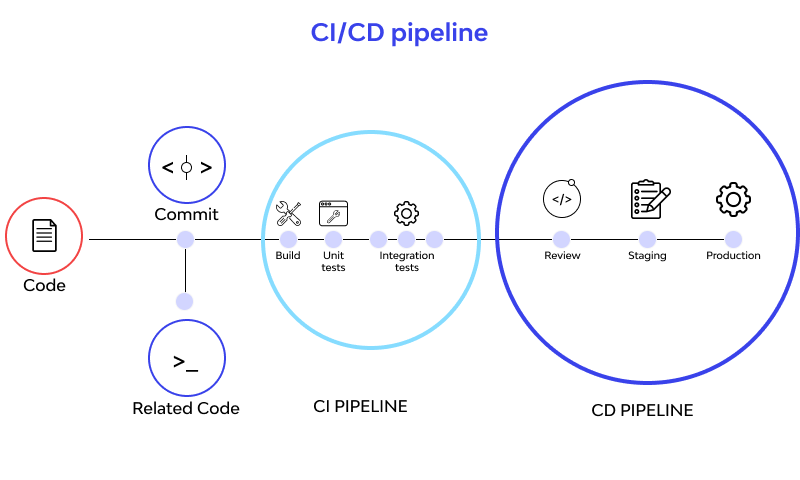

# ***CI/CD PIPELINES***
- [***CI/CD PIPELINES***](#cicd-pipelines)
  - [***What is CI? Benefits?***](#what-is-ci-benefits)
  - [***What is CD? Benefits?***](#what-is-cd-benefits)
  - [***Difference between CD and CDE***](#difference-between-cd-and-cde)
  - [***Why build a pipeline? Business value?***](#why-build-a-pipeline-business-value)
  - [***Create a general diagram of CICD***](#create-a-general-diagram-of-cicd)
  - [***Understand SDLC workflow: plan, design, develop, deploy***](#understand-sdlc-workflow-plan-design-develop-deploy)

## ***What is CI? Benefits?***
   * **CI (Continuous Integration)** is a practice where developers frequently merge their code changes into a shared repository, followed by automated builds and tests.
   * **Benefits:**
     * Detects issues early.
     * Reduces integration problems.
     * Ensures consistent code quality.
     * Speeds up development cycles.

## ***What is CD? Benefits?***
   * **CD (Continuous Delivery)** ensures that code changes are automatically tested and prepared for release to production.
   * **Benefits:**
     * Faster, reliable releases.
     * Fewer manual interventions and errors.
     * Easier rollback of changes.
     * Continuous feedback from end-users.

  ## ***Difference between CD and CDE***
   * **CD (Continuous Delivery)**: Code is automatically tested and ready for release, but deployment is done manually.
   * **CDE (Continuous Deployment)**: Every change that passes automated testing is deployed to production automatically, with no manual intervention.

## ***Why build a pipeline? Business value?***
   * A pipeline automates the process of building, testing, and deploying software.
   * **Business Value:**
     * Increases delivery speed.
     * Ensures higher-quality releases with fewer bugs.
     * Reduces operational risks with repeatable processes.
     * Enhances collaboration between development and operations teams.

## ***Create a general diagram of CICD***
   * A general CICD pipeline diagram can include:
     * **Source Code** → **Build** → **Test** → **Deploy** → **Monitor**
   * This represents the continuous integration, delivery, and deployment flow.

## ***Understand SDLC workflow: plan, design, develop, deploy***
   * **Plan**: Define project scope, gather requirements, and set timelines.
   * **Design**: Create the system architecture and design solutions.
   * **Develop**: Code the solution, conduct tests, and perform integrations.
   * **Deploy**: Release the product to production or end-users.
