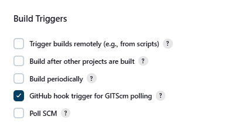

# ***JENKINS***
- [***JENKINS***](#jenkins)
  - [***How to build a Jenkins pipeline***](#how-to-build-a-jenkins-pipeline)
    - [***Access your Jenkins server***](#access-your-jenkins-server)
    - [***Creating job 1***](#creating-job-1)
    - [***Go to Git Bash Window***](#go-to-git-bash-window)
    - [***Setting up Job 2***](#setting-up-job-2)
    - [***Setting up Job 3***](#setting-up-job-3)
## ***How to build a Jenkins pipeline***
 
### ***Access your Jenkins server***
- Ilhaan in server 2
- Saved credentials in .ssh folder 
### ***Creating job 1***
1. Log-in to Jenkins

<br>


2. Select new item.
   <br>
3. Enter a name for the project and select **freestyle project**.
   
<br>


<br>

4. Enable **Discard old builds** and set it to a max of **5**. This means that up to 5 build history are kept in the record at a time.


<br>


<br>

5. Add GitHub project URL: 
<br>


<br>

1. select **Git** and enter your **SSH** repository link.
   1. Add your credentials.
   2. For the **Kind** section, select **SSH Username with private key**.
   3. In **ID**, name it the same as the key.
   4. In description, write what the key is going to be used for.
   5. In the **Username** section, paste the **ID** we just used.
   6. Under **Private Key**, Enable **Enter directly** and input your private key using the ***`cat`*** command.
 
 <br>

 

 

 <br>
 
   1. Click **Add**.
   2. Now, under the **credentials**, you can select the key you've added.
 
1. Add the correct branch
<br>


<br>
 

 
7. In **build-triggers**, select the relevant options
<br>


<br> 
8. In **build environment**,  select the relevant options.
<br>


 
<br>
 
9. In **build-steps**, select execute shell in the drop-down and enter the commands you need to run
<br>


 
<br>

10. Scroll down to **Post-Build Actions**.
11. Select **projects to build**.
12. Input the name of the project you want to trigger after this first job has run successfully :- **ilhaan-job2-ci**
<br>


<br>

13. Select **save**, then select **build now**
<br>


<br> 

14. Select the build under the history. You'll see it has run both, but you can only view the output for the second build if you're in that build's section. You can select the hyper link to go straight the other project.
 

 ### ***Go to Git Bash Window***
- Go to repo > ls and you should see "app".
- `git branch dev`.
- `git switch dev`.
- `nano README.md > add a new line` : "a new lint to test webhook"
  - Ctrl+s, Ctrl+x
- `git add .`
- `git commit -m "Added  line to readme."`
- `git push --set-upstream origin dev`


  ### ***Setting up Job 2***
1. Create a new project, following previous steps such as providing **GitHub** repo links and selecting your **SSH** key.
2. There are a few changes to be made, highlighted below:
<br>

 
 

<br> 
1. Add a build step, with the following commands inside:
 
```bash
git switch main
git merge origin/dev
git push origin main
```
   - These commands will switch the branch to the main (since we're working in the dev branch), merge the dev changes to the main branch and then push it to the GitHub repo.
   - The Jenkins git plugin provides a "git publisher" as a post-build action. The git publisher can push commits or tags from the workspace of a Freestyle project to the remote repository. The git publisher is only available for Freestyle projects.
- In the place of the commands above, you can use the Git Publisher plug-in like this:
<br>

   

<br> 

### ***Setting up Job 3***
- Re-create steps taken in Job 2 except create a **build step** where you select **execute shell** and insert this script
```bash
rsync -avz -e "ssh -o StrictHostKeyChecking=no" app ubuntu@54.170.230.121:~

ssh -o StrictHostKeyChecking=no ubuntu@54.170.230.121 << EOF
    
    pm2 list
    
    cd app
    
    pm2 stop all
    
    npm install
    
    pm2 start app.js

EOF
```

- Now you should be able to edit your app home page using `nano index.ejs` and have the changes deployed within minutes after pushing!
<br>


 
 